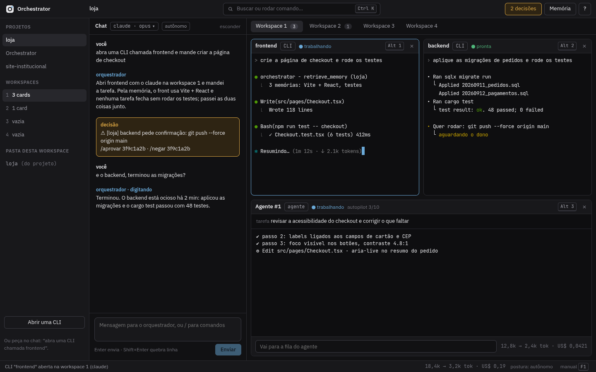
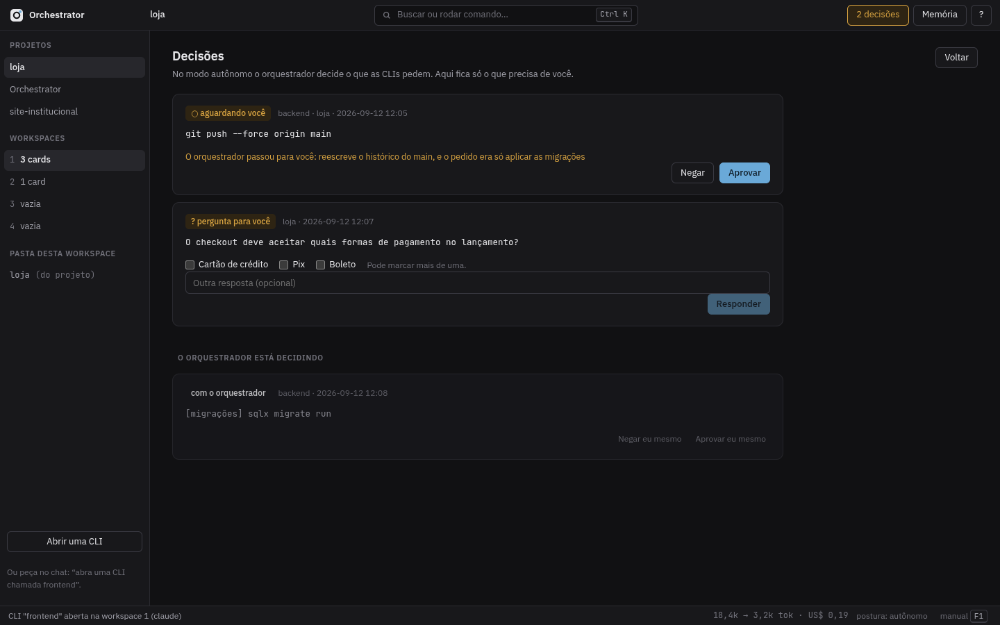
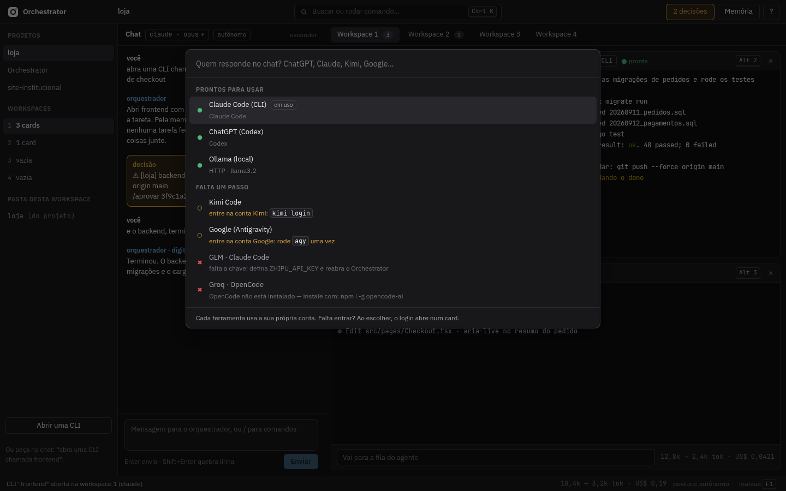
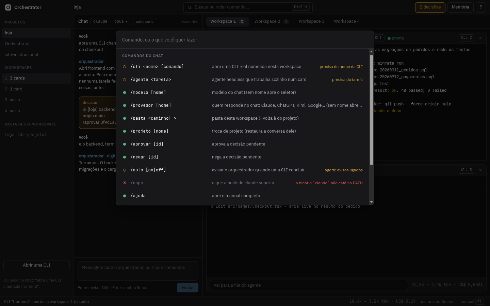
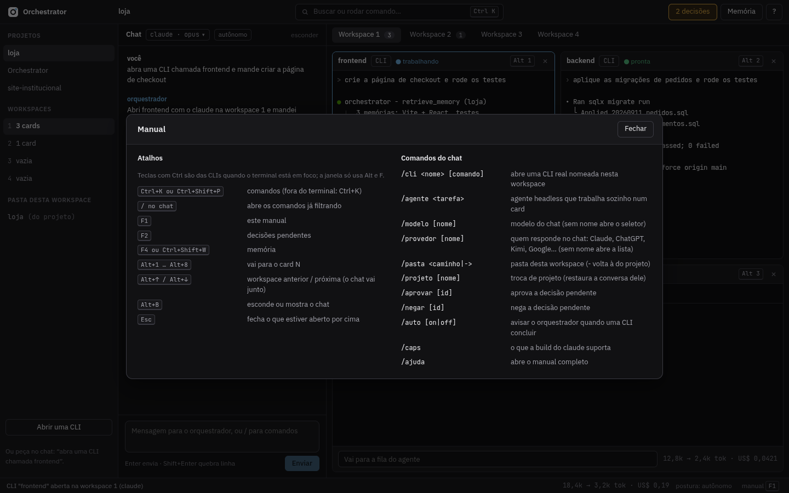

# Orchestrator

Um maestro de agentes de IA que roda no seu computador. Você conversa com ele — na TUI ou no app desktop — e ele abre CLIs de agente reais (Claude Code, Codex, Kimi Code, Antigravity, OpenCode...) como cards, manda as tarefas, e avisa quando cada uma termina. Ele mesmo **não escreve código**: delega, acompanha e decide o que puder decidir sozinho, com memória semântica entre sessões e uma trava de segurança que nenhuma CLI atravessa sem passar por regra.



## Por que

Agentes de código de terminal são ótimos individualmente, mas cada um vive isolado: memória zerada a cada sessão, sem noção do que as outras ferramentas já fizeram, e sem ninguém olhando o que é arriscado antes de rodar. O Orchestrator é a camada que falta:

- **um chat que orquestra, não que codifica** — ele abre CLIs reais para o trabalho pesado e verifica o resultado numa sandbox isolada antes de dar por pronto;
- **memória semântica entre sessões e projetos** — regras do dono, decisões e convenções voltam sozinhas no prompt certo, sem precisar repetir contexto;
- **uma trava de segurança única** — comandos destrutivos são bloqueados; o que é arriscado mas legítimo (push forçado, migração, deploy) vira decisão, revisada por quem for o caso;
- **modo autônomo de verdade** — no dia a dia, quem decide os pedidos das CLIs é o próprio orquestrador; só o que é muito crítico, foge do que foi pedido, ou é escolha sua mesmo, chega até você.

## O que ele faz

- **Delega para CLIs reais**, cada uma num card com terminal de verdade (PTY) — nada de simular teclado: tudo por subprocesso e protocolo (`stream-json`, JSONL, MCP).
- **Fala com sete provedores** com a conta e a ferramenta oficial de cada um — Claude Code, ChatGPT (Codex), Kimi Code, Google (Antigravity), GLM e MiniMax (Claude Code ou OpenCode), e qualquer endpoint compatível com OpenAI (Groq, OpenRouter, Ollama, NVIDIA NIM...). Trocar de provedor é `/provedor`.
- **Guarda memória semântica** — ChromaDB + embeddings multilíngues + reranker, com IAs e regras do dono como autores; cada prompt chega com o índice do que importa.
- **Decide sozinho no modo autônomo** — aprova ou nega os pedidos das CLIs do workspace conforme o que foi pedido; escala ao dono só o que for crítico demais, fugir do escopo, ou precisar de uma escolha (com alternativas de única ou múltipla escolha).
- **Roda em sandbox isolada** para testar o que as CLIs produziram (abrir, clicar, digitar, rodar binário) sem tocar na máquina real.
- **Aparece como TUI (ratatui) e como app desktop (Tauri)** — o mesmo núcleo por trás dos dois, então um comando digitado numa interface se comporta igual na outra. `orchestrator` sozinho já abre a TUI, como `claude`.
- **Sincroniza o modelo com a API do provedor** — o seletor busca a lista de modelos de verdade (`GET /models`) e tem um botão "Testar" que manda um `.` só para confirmar que o modelo processa e responde.

## Interface

<table>
<tr>
<td width="50%">

**Decisões**
Só o que precisa de você: o que o orquestrador passou adiante, com o motivo, e as perguntas com alternativas. O que ele está decidindo sozinho fica visível à parte.



</td>
<td width="50%">

**Provedores**
Cada ferramenta com o estado dela agora: pronta, falta entrar na conta, falta instalar ou falta a chave — com o comando exato para resolver.



</td>
</tr>
<tr>
<td width="50%">

**Paleta de comandos**
`/` ou Ctrl+K abre os comandos do chat, cada um já dizendo se está pronto, o que falta, ou por que não vai funcionar agora.



</td>
<td width="50%">

**Manual embutido**
Atalhos e comandos numa tela só, sem precisar sair do app para descobrir o que dá para fazer.



</td>
</tr>
</table>

## Arquitetura, em uma imagem

```
                     ┌────────────────────────────┐
                     │   orchestrator-engine       │  núcleo sem interface:
                     │   (workspaces, chat, CLIs,  │  workbench, chat, provedores,
                     │    decisões, provedores)    │  decisões — TUI e app leem daqui
                     └───────────┬────────────────┘
                    ┌────────────┼────────────┐
              ┌─────▼─────┐            ┌──────▼──────┐
              │ TUI        │            │ App desktop  │   mesmos comandos `/`,
              │ (ratatui)  │            │ (Tauri+React)│   mesmo estado
              └────────────┘            └──────────────┘

  orchestrator-hook / orchestrator-mcp     →  a trava (crates/mcp-server::gate)
  cada CLI de agente aberta como card      →  PTY real, protocolo próprio por ferramenta
  orchestrator-memoryd                     →  memória semântica (ChromaDB + reranker), API HTTP
```

- **`crates/engine`** — o [`Engine`](crates/engine/src/workbench.rs): projetos, workspaces, cards, chat, provedores e a fila de decisões. Sem UI nenhuma; TUI e app só desenham este estado.
- **`crates/cli-adapter`** — um adaptador por ferramenta (`claude_code`, `codex`, `kimi`, `opencode`, `antigravity`), cada um com o comando certo e o parser da saída dela.
- **`crates/mcp-server`** — a trava (`gate`): mesma decisão para toda ferramenta de IA, seja pelo hook nativo dela ou pelo servidor MCP em modo trava (para quem não tem hook compatível).
- **`crates/memory`** / **`crates/memoryd`** — memória semântica: SQLite para o estado e a fila, ChromaDB + embeddings + reranker para a busca; expõe API HTTP local com um grafo 3D navegável.
- **`crates/tui`** / **`web/apps/desktop`** — as duas interfaces, cada uma com seu framework, sobre o mesmo núcleo.

## Instalando

Um comando abre a TUI — igual `claude`:

```sh
orchestrator          # abre a TUI direto (`orchestrator tui` também funciona)
orchestrator-desktop  # o app — no Linux ele também aparece no menu do KDE Plasma
```

**Dependências** (Rust, Node.js, as bibliotecas do WebKitGTK que o app desktop
precisa): `scripts/instalar-dependencias.sh` verifica, instala (`--instalar`)
ou atualiza (`--atualizar`) tudo na versão atual de cada ferramenta; com
`--provedores` também instala as CLIs de IA opcionais (Codex, Kimi,
Antigravity, OpenCode).

```sh
scripts/instalar-dependencias.sh --instalar
```

**Pacotes Linux**: AppImage, `.deb` e `.rpm` saem de `scripts/empacotar-linux.sh`
(usa o Tauri); uma pasta/tarball portátil — sem instalar nada, sem depender de
FUSE — sai de `scripts/empacotar-portatil-linux.sh`. Os dois levam
`scripts/rodar.sh`, o lançador: abre o app com tela gráfica disponível, a TUI
sem.

Para compilar do zero:

```sh
# workspace inteiro (TUI + serviços de apoio)
cargo build --release

# app desktop (Tauri) — a interface fica em web/apps/desktop
cd web && npm ci
cd apps/desktop && npx tauri build
```

Binários gerados: `orchestrator` (TUI), `orchestrator-desktop` (app), `orchestrator-hook` e `orchestrator-mcp` (a trava, instalados por projeto), `orchestrator-memoryd` (a memória).

**Windows**: ainda não tem pacote pronto (bloqueios documentados em
`.github/workflows/desktop.yml`) — fica para uma próxima etapa.

## Provedores suportados

| Provedor | Ferramenta | Conta |
|---|---|---|
| Claude Code | `claude` (stream-json) | assinatura Anthropic |
| ChatGPT | Codex CLI (`codex exec --json`) | `codex login` |
| Kimi | Kimi Code CLI | `kimi login` |
| Google | Antigravity CLI (`agy`) | login Google AI Pro/Ultra |
| GLM / MiniMax | Claude Code **ou** OpenCode, apontado para o endpoint deles | chave do coding plan |
| Groq (+ OpenRouter, Ollama, NVIDIA NIM) | OpenCode, ou chat HTTP com tool calling próprio | chave da API |

`/provedor` troca quem responde a qualquer momento; a sessão de cada ferramenta fica guardada por conta própria.

## Segurança, em resumo

- Nenhuma automação de teclado: tudo por subprocesso e protocolo estruturado.
- Regras de segurança vivem na memória, não no código — `deny-regex` bloqueia, `ask-regex` vira decisão, `owner-regex` sempre é do dono.
- O modo autônomo nunca desliga a trava (`ORCHESTRATOR_AUTONOMOUS=1` faz o hook virar a autoridade explícita, não `bypassPermissions`).
- Testar o que uma CLI produziu acontece numa sandbox isolada (container), nunca na tela ou na máquina real do usuário.

Detalhes e o histórico de decisões: [`docs/`](docs/) e [`TRAVAMENTOS.md`](TRAVAMENTOS.md).

## Licença

Apache-2.0 — veja [`LICENSE`](LICENSE).
