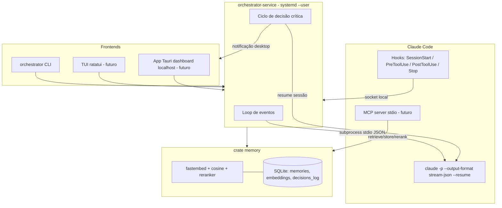

# Arquitetura do Orchestrator

> **Nota:** este documento é do desenho inicial do projeto (fase 1–2) e não foi atualizado — várias partes já mudaram (TUI, app desktop, `/provedor`, o revisor de decisões). Veja o [README](../README.md) para o estado atual e o `TRAVAMENTOS.md` para decisões e armadilhas registradas ao longo do caminho.

O Orchestrator é um "segundo cérebro" de contexto para agentes CLI (inicialmente o Claude Code). Ele roda como um serviço de fundo local do usuário, mantém memória persistente com busca semântica e supervisiona sessões do agente, pausando-o em decisões críticas.

## Workspace multi-crate

```
Orchestrator/
├── crates/
│   ├── core         # Tipos de domínio, erros (thiserror), traits (Adapter, MemoryStore), config
│   ├── memory       # SQLite (rusqlite) + embeddings fastembed + reranker
│   ├── cli-adapter  # Adapter do Claude Code: subprocess `claude -p` + stream-json
│   ├── service      # orchestrator-service: loop de eventos, ciclo de decisão crítica, IPC
│   └── cli          # `orchestrator`: comandos memory/run/status para o usuário
└── (futuro)
    ├── mcp-server   # Servidor MCP stdio expondo a memória ao agente
    ├── tui          # Frontend ratatui
    └── notify       # Notificações desktop (D-Bus / toast)
```

Regras de dependência: `cli`, `service`, `cli-adapter` e `memory` dependem apenas de `core` (e entre si de forma acíclica: `service -> {cli-adapter, memory} -> core`). Nada depende do `service`.

## Fluxo principal

O serviço **nunca** usa automação de teclado/terminal. Toda a integração com o Claude Code é por **subprocess + stdio JSON**:

```
claude -p "<prompt>" --output-format stream-json --resume <session_id>
```

- O adapter (`cli-adapter`) spawna o processo, lê `stdout` linha a linha (NDJSON) e converte cada evento em um tipo Rust tipado.
- Sessões são contínuas via `--resume <session_id>`: o serviço guarda o `session_id` recebido no evento `system/init` e o reutiliza para continuar a conversa após pausas.
- `stderr` e código de saída são capturados para diagnóstico.

## Hooks do Claude Code

Os hooks são a camada de *enforcement* — o agente não pode ignorá-los:

| Hook          | Papel no Orchestrator                                                                 |
|---------------|----------------------------------------------------------------------------------------|
| `SessionStart`| Injeta regras e memórias relevantes (kind `security`/`architecture`) no contexto.       |
| `PreToolUse`  | Consulta o serviço; pode **bloquear** a ferramenta via `permissionDecision: "deny"` (ou `ask`). Memórias `kind=security` são aplicadas aqui obrigatoriamente. |
| `PostToolUse` | Loga o resultado da ferramenta no log de auditoria (`decisions_log`).                   |
| `Stop`        | Loga o fim do turno e decisões tomadas; permite ao serviço avaliar se deve retomar.     |

Cada hook é um binário/script fino que fala com o serviço (socket local) e responde no stdout com o JSON esperado pelo Claude Code (ver `docs/CLI_PROTOCOL.md`).

## Servidor MCP (futuro, crate `mcp-server`)

Servidor MCP por **stdio**, registrado em `.mcp.json`, expondo ferramentas ao agente:

- `retrieve_memory(query, kinds?, top_k)` — busca semântica na memória.
- `store_memory(content, kind, tags?)` — grava nova memória.
- `rerank(query, candidates)` — reordenação com pesos por `kind`.

Assim o agente puxa contexto sob demanda, em vez de depender só da injeção no `SessionStart`.

## Memória

- **SQLite** local (`rusqlite`, bundled) com tabelas `memories`, `embeddings`, `decisions_log` (schema em `docs/MEMORY_SCHEMA.md`).
- **Embeddings** gerados localmente com `fastembed` (nenhum dado sai da máquina).
- **Busca**: brute-force de similaridade de cosseno sobre todos os vetores (volumes locais são pequenos; simples e sem dependência de índice ANN).
- **Reranker**: score final = `cosine * peso(kind)` + boosts (recência, tags). Pesos: `security > architecture > decision > syntax`.

## Ciclo de decisão crítica

1. Durante a sessão, `PreToolUse` detecta uma operação crítica (destrutiva, credenciais, rede externa, mudança de arquitetura — ver `docs/SECURITY.md`).
2. O serviço responde `deny`/`ask`, o agente **pausa**; o estado da sessão (`session_id`) fica preservado.
3. O serviço dispara **notificação desktop** e destaca a decisão pendente na **TUI/dashboard**.
4. O humano aprova ou rejeita; a decisão é gravada em `decisions_log` (append-only).
5. Se aprovada, o serviço **retoma** a sessão com `claude -p --resume <session_id>` passando a instrução de continuar.

## Diagrama



## Frontends futuros

Dois frontends, ambos clientes do serviço (mesma API local):

- **TUI (ratatui)**: acompanhamento em terminal — sessões ativas, stream de eventos, aprovação de decisões críticas.
- **App Tauri**: backend Rust + webview servindo um dashboard em `localhost`, no estilo do opencode — visão de memórias, sessões, log de auditoria e fila de decisões.

Nenhum frontend fala diretamente com o Claude Code; toda mediação passa pelo serviço.
